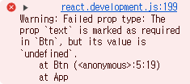
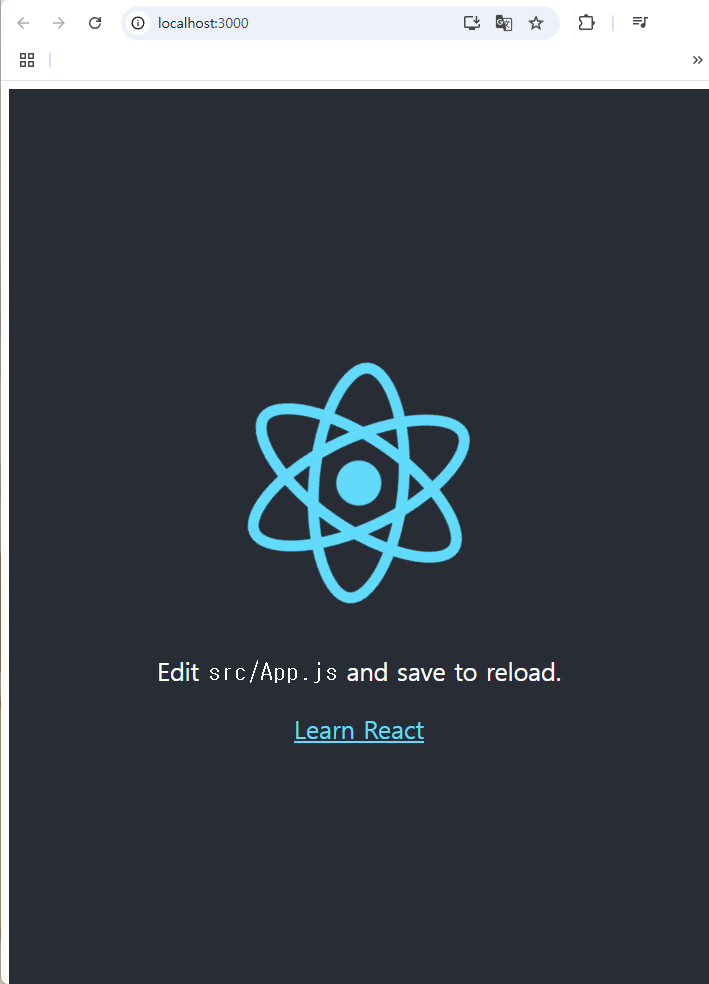
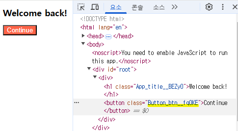
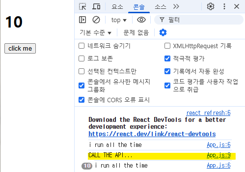

# Nomad-Coders-React-For-Beginners

노마드코더 무료 React 강의 공부 내용 저장소입니다.

## Basics of React

### React 라이브러리를 불러오기 위한 script + JSX 코드를 JavaScript로 변환해주는 babel script 추가

```html
<script src="https://unpkg.com/react@18/umd/react.development.js"></script>
<script src="https://unpkg.com/react-dom@18/umd/react-dom.development.js"></script>
<script src="https://unpkg.com/@babel/standalone/babel.min.js"></script>
```

### React.createElement (잘 사용하지 않음)

JSX 없이 엘리먼트 생성 시 기본 문법
(React Element는 HTML Element와 달리 실제 DOM을 구성하는 요소 X.

리액트 내부에서 사용되는 Element라 볼 수 있다.

이 Element을 사용해 실제 DOM을 구성하기 위해서는 별도의 라이브러리가 필요)

```
const element = createElement(type, props, ...children);
```

_예시) 버튼_

_HTML_

```html
<button
  type="button"
  class="btn"
  onClick="console.log('im clicked')"
  style="background-color: tomato; color: #fff;"
>
  버튼 텍스트가 들어가용
</button>
```

React Element

```html
<body>
  <div id="root"></div>
</body>

<script>
  const button = React.createElement(
      "button", // type
      { // props
          type: "button",
          className : "btn"
          onClick: () => console.log("im clicked"),
          style : {
              backgroundColor: "tomato",
              color: "#fff",
          }
      },
      // children (선택 사항)
      "버튼 텍스트가 들어가용"
  );

  // 화면에 불러오는 방법
  const root = document.getElementById("root");
  const container = React.createElement("div", null, [h3, button]);
  ReactDOM.createRoot(root).render(container);
</script>
```

### JSX 사용 컴포넌트화 방법 (JSX -> JavaScript 변환해주는 Babel 사용중)

React JS <u>컴포넌트의 첫글자는 무조건 대문자</u>. 안그러면 HTML 태그로 잘못읽혀 오류 발생

```html
<script type="text/babel">
  const Button = (
    <button
      style={{
        backgroundColor: "tomato",
      }}
      onClick={() => console.log("im clicked")}
    >
      Click me
    </button>
  );
</script>
```

## STATE

State는 기본적으로 데이터가 저장되는 곳

### 기본 문법

```javascript
const [데이터명, set데이터] = useState(데이터 초기값);
```

_예시 1) 버튼 클릭 시 클릭된 횟수 노출_

```html
<html lang="en">
  <body>
    <div id="root"></div>
  </body>
  <script
    src="https://unpkg.com/react@18/umd/react.development.js"
    crossorigin
  ></script>
  <script
    src="https://unpkg.com/react-dom@18/umd/react-dom.development.js"
    crossorigin
  ></script>
  <script src="https://unpkg.com/@babel/standalone/babel.min.js"></script>
  <script type="text/babel">
    const DOM = ReactDOM.createRoot(document.getElementById("root"));

    const Container = () => {
      const [counter, setCounter] = React.useState(0);
      const onClick = () => {
        setCounter((current) => current + 1);
      };
      return (
        <div>
          <h3>Total Clicks: {counter}</h3>
          <button onClick={onClick}>Click me</button>
        </div>
      );
    };

    DOM.render(<Container />);
  </script>
</html>
```

_예시 2) Input and State_

분 <-> 시, 마일즈 <-> 킬로미터 변환기 만들기

```html
<script type="text/babel">
  const DOM = ReactDOM.createRoot(document.getElementById("root"));

  // JSX 문법을 사용 중이기 때문에 "for > htmlFor"
  function MinutesToHours() {
    const [amount, setAmount] = React.useState(0);
    const [inverted, setInverted] = React.useState(false);
    const onChange = (event) => {
      // console.log("somebody wrote", event.target.value);
      setAmount(event.target.value);
    };
    const reset = () => setAmount(0);
    const onInvert = () => {
      reset();
      setInverted((current) => !current);
    };
    return (
      <div>
        <div>
          <h3>{inverted ? "Hours to Minutes" : "Minutes to Hours"}</h3>
          <label htmlFor="minutes">Minutes</label>
          <input
            value={inverted ? amount * 60 : amount}
            onChange={onChange}
            id="minutes"
            placeholder="Minutes"
            type="number"
            disabled={inverted === true}
          />
        </div>

        <div>
          <label htmlFor="hours">Hours</label>
          <input
            value={inverted ? amount : Math.round(amount / 60)}
            onChange={onChange}
            id="hours"
            placeholder="Hours"
            type="number"
            disabled={inverted === false}
          />
          <button onClick={reset}>Reset</button>
          <button onClick={onInvert}>{inverted ? "H to M" : "M to H"}</button>
        </div>
      </div>
    );
  }

  function KmToMiles() {
    const [amount, setAmount] = React.useState(0);
    const [inverted, setInverted] = React.useState(false);
    const onChange = (event) => {
      // console.log("somebody wrote", event.target.value);
      setAmount(event.target.value);
    };
    const reset = () => setAmount(0);
    const onInvert = () => {
      reset();
      setInverted((current) => !current);
    };
    return (
      <div>
        <div>
          <h3>{inverted ? "Miles to Km" : "Km to Miles"}</h3>
          <label htmlFor="km">km</label>
          <input
            value={inverted ? amount / 1.609 : amount}
            onChange={onChange}
            id="km"
            placeholder="Km"
            type="number"
            disabled={inverted === true}
          />
        </div>

        <div>
          <label htmlFor="mile">Miles</label>
          <input
            value={inverted ? amount : amount * 1.609}
            onChange={onChange}
            id="mile"
            placeholder="mile"
            type="number"
            disabled={inverted === false}
          />
          <button onClick={reset}>Reset</button>
          <button onClick={onInvert}>
            {inverted ? "km to miles" : "miles to km"}
          </button>
        </div>
      </div>
    );
  }

  function App() {
    const [index, setIndex] = React.useState("xx");
    const onSelect = (e) => {
      setIndex(e.target.value);
    };
    return (
      <div>
        <div>
          <h1>Super Converter</h1>
          <select value={index} onChange={onSelect}>
            <option value="xx">Select your units</option>
            <option value="0">Minutes & Hours</option>
            <option value="1">Km & Miles</option>
          </select>
          <hr />
          {index === "xx" ? "Please select your units" : null}
          {index === "0" ? <MinutesToHours /> : null}
          {index === "1" ? <KmToMiles /> : null}
        </div>
      </div>
    );
  }

  DOM.render(<App />);
</script>
```

## Props & PropTypes

### Props

Props 란, 부모 컴포넌트(App)가 자식 컴포넌트(아래 예시에선 Btn)에게 데이터를 보내는 방식을 뜻한다.

그때그때 원하는 값을 넣어서 쉽게 재사용할 수 있게 해주는 것이 Props.

_예시 ) 버튼 컴포넌트 재사용_

`props`로 전달하는 경우

```html
<script type="text/babel">
  const DOM = ReactDOM.createRoot(document.getElementById("root"));

  function Btn(props) {
    console.log(props);

    return (
      <button
        style={{
          backgroundColor: "tomato",
          color: "white",
          padding: "10px 20px",
          border: 0,
          borderRadius: 10,
          fontSize: props.fontSize,
        }}
      >
        {props.text}
      </button>
    );
  }

  const App = () => {
    return (
      <div>
        <Btn text="Save Changes" fontSize={16} />
        <Btn text="Confirm" fontSize={20} />
      </div>
    );
  };

  DOM.render(<App />);
</script>
```

> 여기에 더해서 props 에 값을 계속 추가하면 그만큼 "props.~~" 으로 시작하는 코드를 계속 추가해야 함. 이런 불편함을 개선하기 위해서, props 를 받으면서 바로 속성값 이름을 그대로 받을 수 있다. (아래 예시 참고)

`props.속성네이밍` -> `{속성네이밍}`

```html
<script type="text/babel">
    ...
    // props.text, props.changeValue 에서 {text, changeValue}로 바뀜
    function Btn({ text, changeValue }) {
      console.log(text, "was rendered");
      return (
        <button
          onClick={changeValue}
          style={{
            backgroundColor: "tomato",
            color: "white",
            padding: "10px 20px",
            border: 0,
            borderRadius: 10,
          }}
        >
          {text}
        </button>
      );
    }
    function App() {
      const [value, setValue] = React.useState("Save Changes");
      const changeValue = () => setValue("Revert Changes");
      return (
        <div>
          <Btn text={value} changeValue={changeValue} />
          <Btn text="Continue" />
        </div>
      );
    }
  ...
</script>
```

`<Btn text={value} changeValue={changeValue} />`에서 changeValue 실행 시 `<App />` 부모 컴포넌트에 있는 모든 `<Btn/>` 자식 컴포넌트가 리랜더링 되고 있다.

바뀌는 값을 반영해야할 컴포넌트만 불러오기 위해서는 아래의 방법을 사용해야한다.

### Memo

위의 코드에서의 단점은 `<Btn />` 컴포넌트에 `changeValue` function을 전달하고 있는 컴포넌트를 포함한 모든 `<Btn />` 컴포넌트가 리랜더링 된다는 점이 있다.

이를 막기 위해서는 아래와 같이 작업하면 된다.

```html
<script type="text/babel">
  ...
  function Btn({ text, changeValue }) {
    console.log(text, "was rendered");
    return (
      <button
        onClick={changeValue}
        style={{
          backgroundColor: "tomato",
          color: "white",
          padding: "10px 20px",
          border: 0,
          borderRadius: 10,
        }}
      >
        {text}
      </button>
    );
  }

    // React.memo(컴포넌트명) 사용!
  const MemorizedBtn = React.memo(Btn);

  function App() {
    const [value, setValue] = React.useState("Save Changes");
    const changeValue = () => setValue("Revert Changes");
    return (
      <div>
        <MemorizedBtn text={value} changeValue={changeValue} />
        <MemorizedBtn text="Continue" />
      </div>
    );
  }
  ...
</script>
```

## Prop Types

`JavaScript`를 사용하고 있는 경우 `prop`이 많아지게 되면 때때로 데이터를 잘못 전달하는 실수를 할 가능성이 높아진다.

(React v15.5까지는 PropTypes 체크 기능이 사용되었지만 현재는 사용하지 않고 있다고 명시되어 있다. 이유는 `TypeScript`에는 타입 체킹 기능이 있는데 최근에는 `ReactJS`가 `TypeScript`를 통해 사용되고 있기 때문)

[참조 링크] (https://legacy.reactjs.org/docs/typechecking-with-proptypes.html "구 ReactJS 홈페이지로 이동")

예를 들면 `fontSize`에는 숫자가 전달되어야만 하는데, 문자열이 전달되는 등..

각 prop 마다 어떤 데이터 타입을 받아야 하는지 React는 체크해주지 않는다.

그래서 `PropTypes` 라는 라이브러리를 사용해야 한다.

아래의 script를 `<head></head>` 태그 내에 추가해주자!

```html
<script src="https://unpkg.com/prop-types@15.6/prop-types.js"></script>
```

사용 방법

```javascript
컴포넌트명.propTypes = {
  prop1: PropTypes.string,
  prop2: PropTypes.number,
  prop3: PropTypes.boolean,
  // 필수 속성인 경우 .isRequired 추가
  requiredProp: PropTypes.string.isRequired,
};
```

_예시 ) 버튼_

```javascript
...
// prop의 기본값 설정 가능 (ex. fontSize = 12)
function Btn({text, fontSize = 12}) {
        return (
            <button
                style={{
                backgroundColor: "tomato",
                color: "white",
                padding: "10px 20px",
                border: 0,
                borderRadius: 10,
                fontSize: fontSize,
            }}>{text}{age}</button>
        );
    }

    Btn.propTypes = {
        text: PropTypes.string.isRequired,
        fontSize: PropTypes.number,
    }

    function App() {
        return (
            <div>
                <Btn text="Save Changes" fontSize={18} />
                <Btn />
            </div>
        );
    };
...
```

`App` 내의 2개의 자식 컴포넌트 `Btn` 중 첫번째 `<Btn text="Save Changes" fontSize={18} />`는 정상적으로 불러와진다.

두번째 `<Btn />`은 오류가 발생한다. 이유는 **필수 속성인 text 값이 입력되지 않았기 때문**



`propTypes` 라이브러리를 사용하면 위와 같이 타입이 맞지 않거나 필수인 값이 입력되지 않은 경우 오류 콘솔이 찍혀 잘못입력된 사실을 알 수 있다.

## CRA (Create React App)

Node.js를 이용해서 `create-react-app`을 사용하면 수많은 스크립트들과 많은 사전 설정들을 React에서 준비해준다.

### 사전 준비

1. 일단 [Node.js](https://nodejs.org/ko) 를 설치해야함.
2. 설치가 됐는지 `window + R` 키를 눌러 `cmd`를 실행시켜 준 뒤. `node -v`를 이용해 현재 노드 버전을 체크해준다. (설치됐다면 정상적으로 버전이 확인된다!)

### 시작

1. 이제 만들고 싶은 폴더 안에 터미널을 열고 `npx create-react-app 폴더명`을 이용하여 새 프로젝트를 생성한다.

2. 설치가 완료되면 생성된 폴더에서 터미널에 `npm start` 명령을 입력해준다.

3. 그럼 자동으로 브라우저 새창에 서버가 열린다.



4. 이제 본격적으로 작업 시작 전. 필요한 소스를 제외한 나머지 소스들을 삭제해준다.

- `App.js`와 `index.js` 빼고는 삭제

5. 삭제된 소스들을 불러오지 않도록 기본값만 남긴채 `App.js`, `index.js`도 수정해준다.

_예시) `index.js` 수정 후_

```javascript
import React from "react";
import ReactDOM from "react-dom/client";
import App from "./App";

const root = ReactDOM.createRoot(document.getElementById("root"));
root.render(
  <React.StrictMode>
    <App />
  </React.StrictMode>
);
```

_예시) `App.js` 수정 후_

```javascript
function App() {
  return (
    <div>
      <h1>Welcome back!</h1>
    </div>
  );
}

export default App;
```

### 컴포넌트 생성해보기

`src` 폴더 내에 `Button.js`를 생성해보자.

`Button.js` 버튼 컴포넌트 생성

```javascript
import PropTypes from "prop-types";

function Button({ text }) {
  return <button>{text}</button>;
}

Button.propTypes = {
  text: PropTypes.string.isRequired,
};

export default Button;
```

### 만든 컴포넌트를 App에 보이게 해보기

`App.js`

```javascript
import Button from "./Button";

function App() {
  return (
    <div>
      <h1>Welcome back!</h1>
      <Button text={"Continue"} />
    </div>
  );
}

export default App;
```

이렇게 하면 App에 Button 컴포넌트를 불러오 쓸 수 있다.

### 컴포넌트별 css 적용하는 방법

1. `src` 폴더 내에 `Button.module.css` 파일을 생성한다.

```css
.btn {
  color: white;
  background-color: tomato;
}
```

2. 해당 css를 `Button.js`에 불러온다.

```javascript
import PropTypes from "prop-types";
import styles from "./Button.module.css";

function Button({ text }) {
  return <button className={styles.btn}>{text}</button>;
}

Button.propTypes = {
  text: PropTypes.string.isRequired,
};

export default Button;
```

하면 `App`에는 아래와 같이 App 컴포넌트 class와 중복되지 않는 클래스명이 붙은 채 불러와진다. (react super cool~~~~~~)



> 똑같이 App.js에도 `App.module.css`를 불러와서 h1에 스타일을 입혀주었다. 마찬가지로 "APP_title\_\_@"로 class 명이 생성된 것을 확인할 수 있다.

## EFFECTS

### Introduction

ISSUE : 가끔은 한번만 실행하거나, 특정상황에만 실행하고 싶은 로직들이 있음.

_예시) 버튼 클릭 시 카운트_

state가 변경될 때 항상 모든 코드가 다시 실행됨

```javascript
import { useState } from "react";

function App() {
  const [counter, setValue] = useState(0);
  const onClick = () => setValue((prev) => prev + 1);
  console.log("call an api");
  return (
    <div>
      <h1>{counter}</h1>
      <button onClick={onClick}>click me</button>
    </div>
  );
}

export default App;
```

`counter` 값만 바뀌어도 모든 코드가 재실행됨.

state가 변화하든 무슨 일이 일어나든 코드가 단 한번만 실행되게 하고 싶은 경우

SOLUTION : `useEffect`를 사용하면 된다!

### useEffect

기본 문법

```javascript
import { useEffect } from "react";

useEffect(() => {}, []);

// useEffect(()=>{실행할 코드}, [지켜볼 대상, 지켜볼 대상, ...]);
```

지켜볼 대상이 변할 때 코드가 실행된다.

지켜볼 대상은 여러개도 가능함

_예시) 버튼 클릭 시 카운트_

```javascript
import { useState, useEffect } from "react";

function App() {
  const [counter, setValue] = useState(0);
  const onClick = () => setValue((prev) => prev + 1);
  console.log("i run all the time");

  useEffect(() => {
    console.log("CALL THE API...");
  }, []);

  return (
    <div>
      <h1>{counter}</h1>
      <button onClick={onClick}>click me</button>
    </div>
  );
}

export default App;
```



위 사진과 같이 첫 렌더링 시에만
"i run all the time", "CALL THE API..." 콘솔이 찍히고

`click me` 버튼 클릭 시 "i run all the time"만 찍히는 것을 확인할 수 있다.

이유는 지켜볼 대상에 [] 빈 배열을 넣어주었기 때문에 코드가 단 한번만 실행되는 것.

### useEffect. 코드의 특정 부분만이 변화했을 때 원하는 코드를 실행할 수 있는 방법

_이슈) 검색 input 값이 변화할 때, 버튼 클릭했을 때 모든 코드가 재실행됨_

```javascript
import { useState, useEffect } from "react";

function App() {
  const [counter, setValue] = useState(0);
  const [keyword, setKeyword] = useState("");
  const onClick = () => setValue((prev) => prev + 1);
  const onChange = (event) => setKeyword(event.target.value);
  console.log("i run all the time");

  useEffect(() => {
    console.log("CALL THE API...");
  }, []);

  console.log("search for", keyword);

  return (
    <div>
      <input
        onChange={onChange}
        type="text"
        placeholder="Search here..."
        value={keyword}
      ></input>
      <h1>{counter}</h1>
      <button onClick={onClick}>click me</button>
    </div>
  );
}

export default App;
```

위와 같이 작업하게 되는 경우.

`input`의 `value`가 변화할 때, `button`을 클릭 해 `counter`가 변화할 때 둘 다 모든 코드가 다시 실행되는 것을 알 수 있다.


_해결) 특정 상황에서 특정 코드만 실행되도록 하는 방법_

```javascript
import { useState, useEffect } from "react";

function App() {
  const [counter, setValue] = useState(0);
  const [keyword, setKeyword] = useState("");
  const onClick = () => setValue((prev) => prev + 1);
  const onChange = (event) => setKeyword(event.target.value);

  useEffect(() => {
    console.log("I run only once.");
  }, []);
  // 빈 배열은 감시할 대상이 없으므로 딱 한번만 실행됨.

  useEffect(() => {
    console.log("I run when 'keyword' changes.");
  }, [keyword]);
  // 'keyword'가 변화할 때 코드를 실행할 거라고 react.js에게 알려주는 것

  useEffect(() => {
    console.log("I run when 'counter' changes.");
  }, [counter]);
  // 'counter'가 변화할 때 코드를 실행할 거라고 react.js에게 알려주는 것

  return (
    <div>
      <input
        onChange={onChange}
        type="text"
        placeholder="Search here..."
        value={keyword}
      ></input>
      <h1>{counter}</h1>
      <button onClick={onClick}>click me</button>
    </div>
  );
}

export default App;
```

결과


